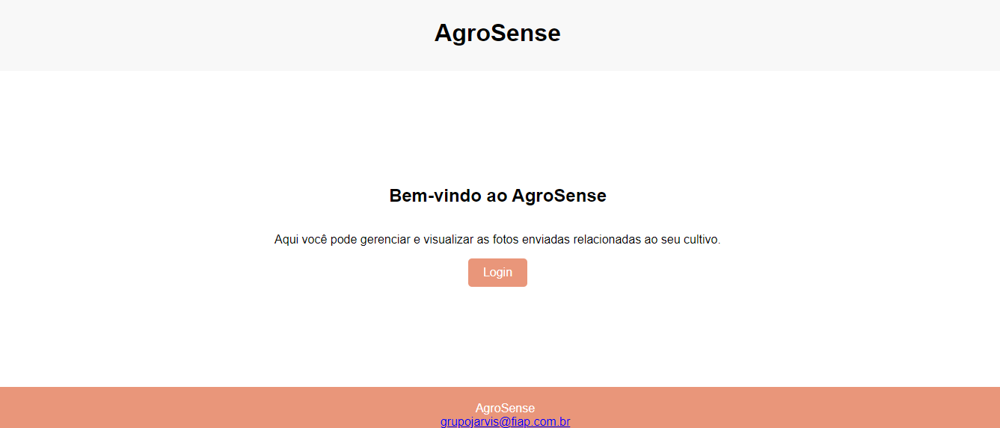
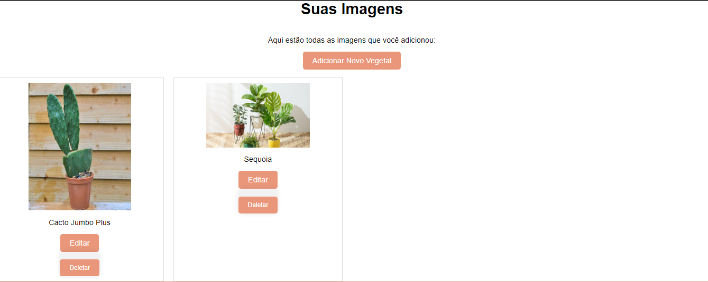
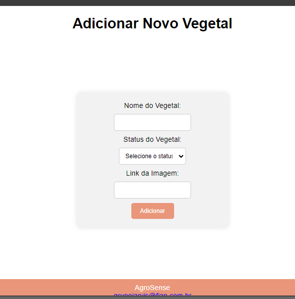
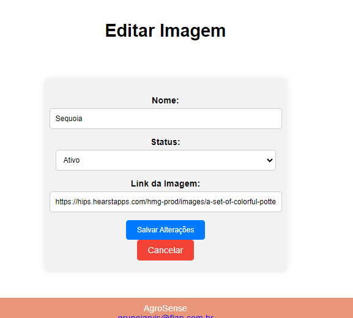
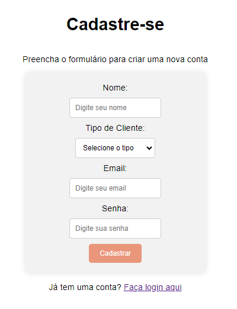

<div align="center" id="top"> 
  
  <h1 align="center">AgroSense</h1>
</div>

<p align="center">
  
  
  
</p>

<p align="center">
  <a href="https://github.com/CharCarvalho" target="_blank">Autor</a>
</p>

## 📝 Sobre

O projeto **AgroSense** é uma aplicação web desenvolvida em Java utilizando Spring Boot e Thymeleaf. A aplicação permite aos usuários gerenciar e visualizar fotos relacionadas ao cultivo de vegetais, oferecendo uma interface amigável para adicionar, editar e remover imagens.
## 🎥 Video de Demonstração

<div align="center">
  <iframe width="560" height="315" src="https://www.youtube.com/embed/C-0Y5qHem6w" frameborder="0" allow="accelerometer; autoplay; encrypted-media; gyroscope; picture-in-picture" allowfullscreen></iframe>
</div>

## ✨ Funcionalidades

- ✅ Página inicial com informações sobre o AgroSense e link para login.
- ✅ Login para acesso às funcionalidades.
- ✅ Visualização das imagens enviadas.
- ✅ Adicionar novas imagens de vegetais.
- ✅ Editar informações de imagens existentes.
- ✅ Remover imagens do sistema.
- ✅ Cadastro de novos usuários.

## 🚀 Tecnologias

As seguintes ferramentas foram utilizadas neste projeto:

- [Java Spring Boot](https://spring.io/projects/spring-boot)
- [Thymeleaf](https://www.thymeleaf.org/)
- [Eclipse IDE](https://www.eclipse.org/)

## ✔️ Requisitos

Antes de começar, certifique-se de ter [Git](https://git-scm.com) e [Java JDK](https://www.oracle.com/java/technologies/javase-jdk11-downloads.html) instalados.

## 🏁 Começando

```bash
# Clone este projeto
$ git clone https://github.com/SeuUsuario/AgroSense

# Acesse o diretório
$ cd AgroSense

# Compile e execute o projeto
$ ./mvnw spring-boot:run

# A aplicação estará disponível em http://localhost:8080
```

## 📂 Estrutura do Projeto

O projeto está organizado da seguinte forma:

- **`/src/main/java`**: Contém o código-fonte da aplicação.
- **`/src/main/resources`**: Contém arquivos de configuração e templates Thymeleaf.
- **`/src/test/java`**: Contém os testes automatizados da aplicação.

## 🌐 Navegando pela Aplicação

### Página Inicial

- **URL:** `/`
- **Descrição:** Página que dá as boas-vindas ao usuário e fornece um link para a página de login.

### Login

- **URL:** `/login_page`
- **Descrição:** Formulário para login do usuário.

### Imagens

- **URL:** `/images_page/{idCliente}`
- **Descrição:** Exibe a lista de imagens de vegetais adicionadas pelo usuário.

### Adicionar Novo Vegetal

- **URL:** `/images_page/add`
- **Descrição:** Formulário para adicionar um novo vegetal.

### Editar Imagem

- **URL:** `/images_page/edit/{idVegetais}`
- **Descrição:** Formulário para editar as informações de uma imagem existente.

### Deletar Imagem

- **URL:** `/images_page/delete/{idVegetais}`
- **Descrição:** Remove uma imagem do sistema.

### Editar Dados do Usuário

- **URL:** `/user_edit`
- **Descrição:** Formulário para editar os dados do usuário.

## 🖥️ Interface da Aplicação

### Página Inicial



### Imagens



### Formulário de Adição



### Formulário de Edição



### Login


### Register



## 🚀 Deploy

O projeto pode ser acessado através do link abaixo (se disponível):

- **[AgroSense Online](https://agrosense-app.azurewebsites.net/)**
